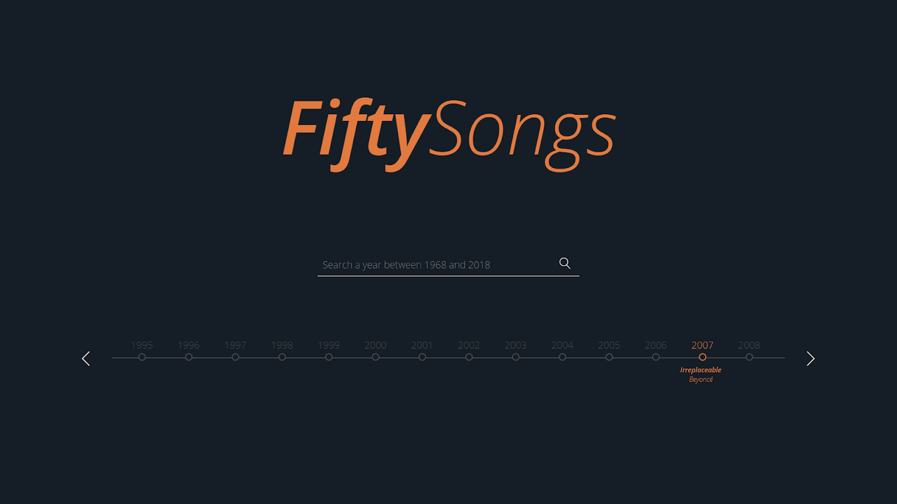

# Multimédia e Novos Serviços - FiftySongs

## Objetivo
O objetivo deste projeto é fazer um site do tipo informativo, interativo e apelativo para o utilizador. Neste site o utilizador poderá saber qual o maior sucesso musical de cada ano entre 1968 e 2018. Para além disso, poderá ouvir as mesmas e assistir ao vídeo clip. Pretende-se, assim, que o utilizador consiga ver a evolução da música ao longo do tempo, de forma dinâmica.

## Funcionalidades
Acedendo ao nosso site é esperado que o utilizador disponha de um conjunto de funcionalidades. Estas incidem sobre um motor de busca dinâmico, podendo o utilizador especificar um ano, entre 1968 e 2018. Desta pesquisa o utilizador poderá, então, encontrar informações sobre a música desse ano, assim como ouvir e visualizar o video clip da mesma. Caso o utilizador queira, apenas, obter uma preview da música de um determinado ano, poderá usar o hover sobre uma barra cronológica. Além disso, é dado ao utilizador a capacidade de mudar o volume da música ou pausar a mesma

## Sequência de Uso
1. Utilizador vê a música e o seu artista dando hover ao ano na barra cronológica;

2. Utilizador escolhe um ano (na barra cronológica ou na barra de pesquisa) e escolhe ver informações sobre a música;

3. Utilizador dá hover no “disco” de modo a poder visualizar melhor a foto relacionada com a música;

4. Utilizador escolhe ouvir a música e o “disco” começa a rodar;

## Como Correr
Abrir o ficheiro **index.html** que se encontra na pasta **/pages**.
